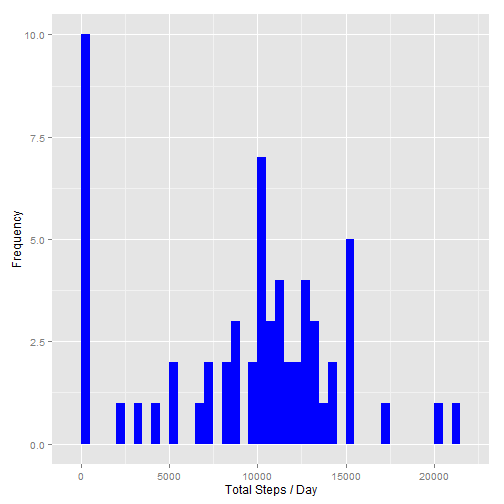
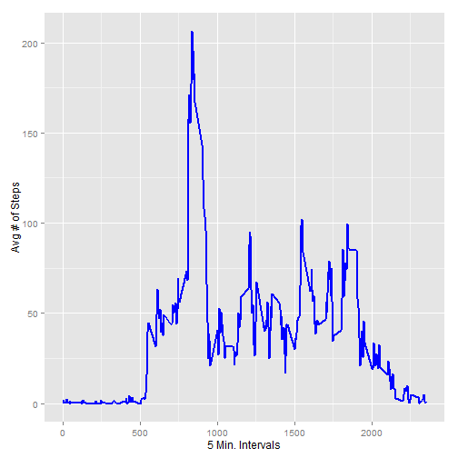
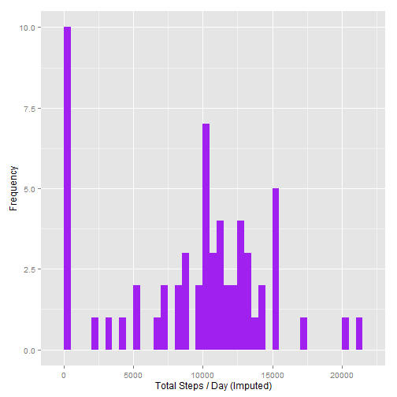
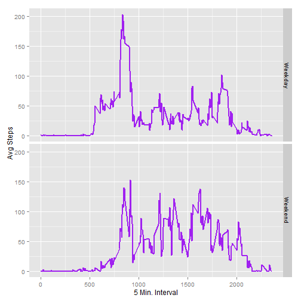

# Reproducible Research: Peer Assessment 1

#### Load 'ggplot2', 'scales', and 'Hmisc (for imputing)' in case it's not loaded on the user's console.

```r
library(ggplot2)
library(scales)
library(Hmisc)
```

## Loading and preprocessing the data
#### 1. Load the data from the "activity.csv" file

```r
activityData <- read.csv('activity.csv')
```
#### 2. Process/transform the data (if necessary) into a format suitable for your analysis
##### Format to add column for day-of-week to provide additional breakout

```r
activityData$DayOfWeek<-weekdays(as.Date(activityData$date))
```

--------------------

## What is mean total number of steps taken per day? (Also asks for Median)
#### 1. Calculating both mean and median daily steps

```r
DailySteps <- tapply(activityData$steps, activityData$date, sum, na.rm=TRUE)
TotalDailySteps <- sum(DailySteps)
DailySteps_Mean <- mean(DailySteps)
DailySteps_Median <- median(DailySteps)
```
* Total Steps = 570608
* Mean = 9354.2295082
* Median =  10395

##### 1. Histogram of the total number of steps taken each day

```r
qplot(DailySteps, xlab='Total Steps / Day', ylab='Frequency', geom="histogram", fill = I("blue"), binwidth=500)
```

 

--------------------

## What is the average daily activity pattern?

```r
AvgStepsPerInterval <- aggregate(x=list(meanOfSteps=activityData$steps), by=list(interval=activityData$interval), FUN=mean, na.rm=TRUE)
```

##### 1. Make a time series plot

```r
ggplot(data=AvgStepsPerInterval, aes(x=interval, y=meanOfSteps)) +
    geom_line(color='blue', size=1) +
    xlab("5 Min. Intervals") +
    ylab("Avg # of Steps") 
```

 

##### 2. Which 5-minute interval, on average across all the days in the dataset, contains the maximum number of steps?

```r
MaxStepsInterval <- which.max(AvgStepsPerInterval$meanOfSteps)
```

* Interval with the Most Steps is: 104

--------------------

## Imputing missing values
##### 1. Calculate and report the total number of missing values in the dataset 

```r
SumMissingValues <- sum(is.na(activityData$steps))
```

* Number of missing values: 2304

##### 2. Devise a strategy for filling in all of the missing values in the dataset.

* Strategy is to impute data with median value as constant.

##### 3. Create a new dataset that is equal to the original dataset but with the missing data filled in.

```r
ImputeData <- activityData
ImputeData$steps <- impute(activityData$steps, fun=median)
```


##### 4. Make Histogram of total # of steps per day, then calculate & report the mean & median number of steps taken per day.

```r
ImputedStepsByDay <- tapply(ImputeData$steps, ImputeData$date, sum)
qplot(ImputedStepsByDay, xlab='Total Steps / Day (Imputed)', ylab='Frequency', geom="histogram", fill = I("purple"), binwidth=500)
```

 


```r
ImputedStepsByDay_Mean <- mean(ImputedStepsByDay)
ImputedStepsByDay_Median <- median(ImputedStepsByDay)
```
* Mean of Imputed Data = 9354.2295082
* Median of Imputed Data =  1.0395 &times; 10<sup>4</sup>

##### 5. Do these values differ from the estimates from the first part of the assignment?

* When imputing the "mean", the values WILL DIFFER in the Histogram.
* When imputing the "median" as I have above, the values WILL NOT DIFFER as seen in the 2 Histograms.

--------------------

## Are there differences in activity patterns between weekdays and weekends?
##### 1. Create a new factor variable with two levels - "Weekday" and "Weekend" to indicate type of day.


```r
weekdays1<-c('Monday', 'Tuesday', 'Wednesday', 'Thursday', 'Friday')
ImputeData$DayType<-c('Weekend','Weekday')[(weekdays(as.Date(ImputeData$date)) %in% weekdays1)+1L]
```

##### 2. Make a panel plot containing a time series plot


```r
ImputeActivityData_Avg <- aggregate(steps ~ interval + DayType, data=ImputeData, mean)
ggplot(ImputeActivityData_Avg, aes(interval, steps)) + 
    geom_line(color='purple', size=1) +
    facet_grid(DayType ~ .) +
    xlab("5 Min. Interval") + 
    ylab("Avg Steps")
```

 
